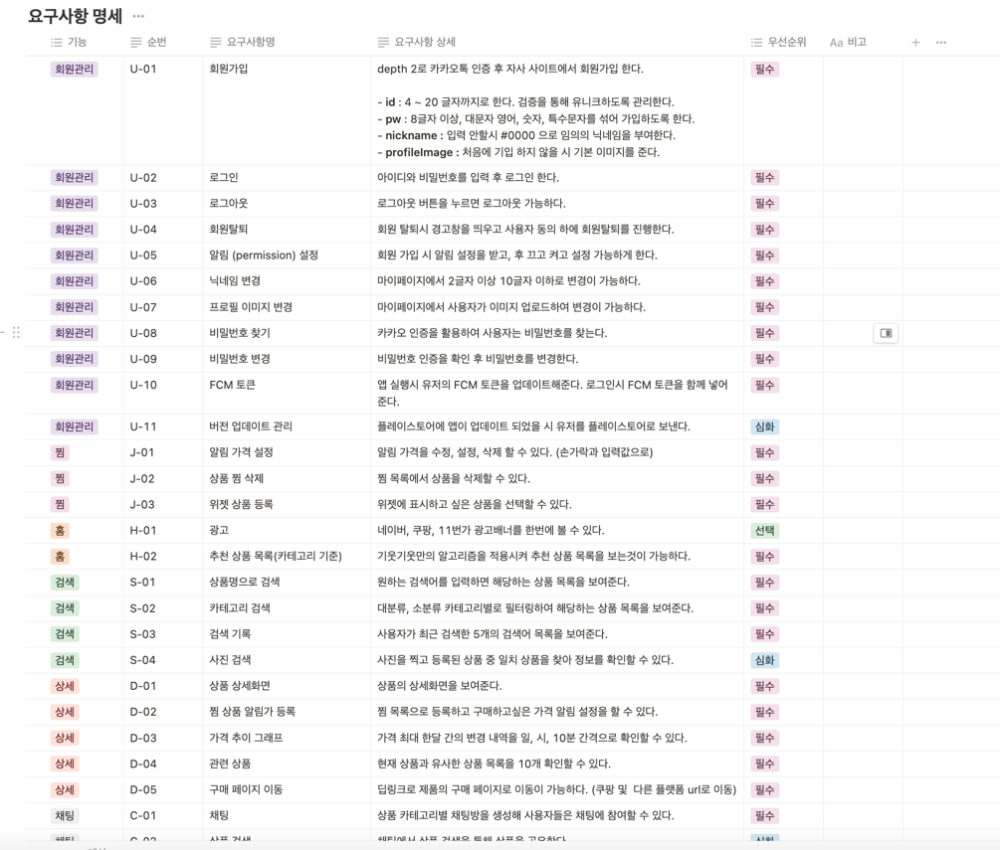
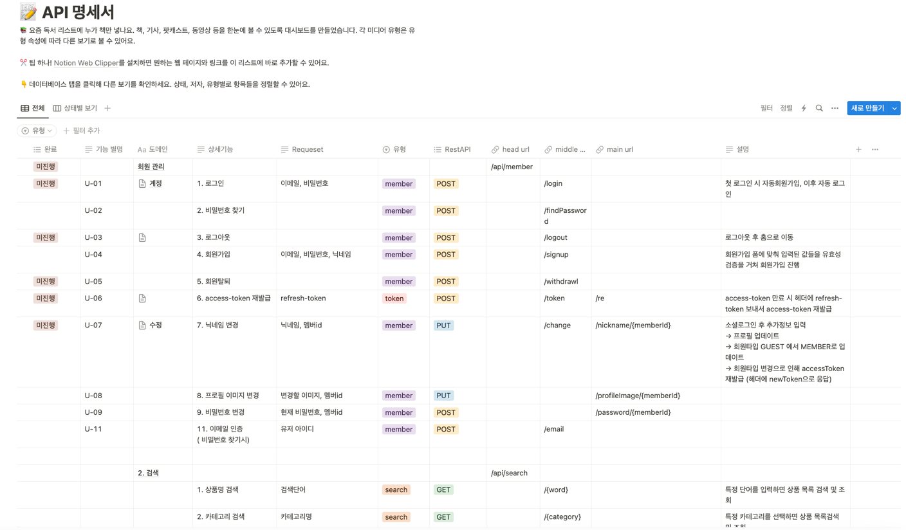
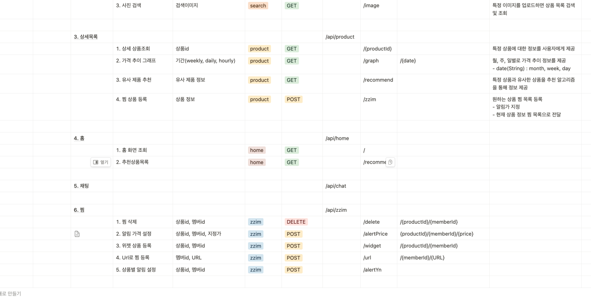
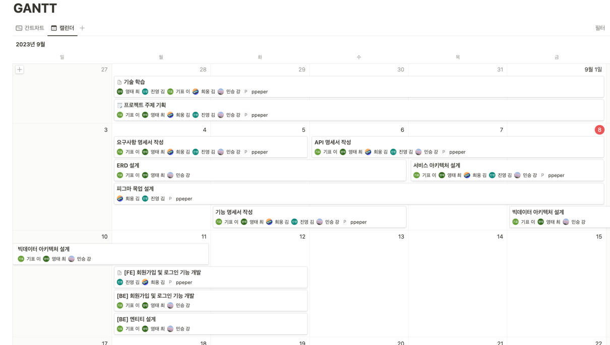

# TIL-23.09.04

## docker-compose를 통한 kafka 클러스터 구축

### 1. EC2 접속 후 도커 컴포즈 설치
```bash
$ sudo curl -L "https://github.com/docker/compose/releases/download/1.29.2/docker-compose-$(uname -s)-$(uname -m)" -o /usr/local/bin/docker-compose
$ sudo chmod +x /usr/local/bin/docker-compose
```

### 2. docker-compose 파일 작성
```bash
# 폴더 생성
$ mkdir ./kafka
# compose 파일 작성
$ vi docker-compose.yml
```

```html
# docker-compose.yml
---
version: '3.8'
services:
zookeeper-1:
image: confluentinc/cp-zookeeper:latest
ports:
- '32181:32181'
environment:
ZOOKEEPER_CLIENT_PORT: 32181
ZOOKEEPER_TICK_TIME: 2000
>
kafka-1:
image: confluentinc/cp-kafka:latest
ports:
- '9092:9092'
depends_on:
- zookeeper-1
environment:
KAFKA_BROKER_ID: 1
KAFKA_ZOOKEEPER_CONNECT: zookeeper-1:32181
KAFKA_LISTENER_SECURITY_PROTOCOL_MAP: INTERNAL:PLAINTEXT,EXTERNAL:PLAINTEXT
KAFKA_INTER_BROKER_LISTENER_NAME: INTERNAL
KAFKA_ADVERTISED_LISTENERS: INTERNAL://kafka-1:29092,EXTERNAL://localhost:9092
KAFKA_DEFAULT_REPLICATION_FACTOR: 3
KAFKA_NUM_PARTITIONS: 3
>
kafka-2:
image: confluentinc/cp-kafka:latest
ports:
- '9093:9093'
depends_on:
- zookeeper-1
environment:
KAFKA_BROKER_ID: 2
KAFKA_ZOOKEEPER_CONNECT: zookeeper-1:32181
KAFKA_LISTENER_SECURITY_PROTOCOL_MAP: INTERNAL:PLAINTEXT,EXTERNAL:PLAINTEXT
KAFKA_INTER_BROKER_LISTENER_NAME: INTERNAL
KAFKA_ADVERTISED_LISTENERS: INTERNAL://kafka-2:29093,EXTERNAL://localhost:9093
KAFKA_DEFAULT_REPLICATION_FACTOR: 3
KAFKA_NUM_PARTITIONS: 3
>
kafka-3:
image: confluentinc/cp-kafka:latest
ports:
- '9094:9094'
depends_on:
- zookeeper-1
environment:
KAFKA_BROKER_ID: 3
KAFKA_ZOOKEEPER_CONNECT: zookeeper-1:32181
KAFKA_LISTENER_SECURITY_PROTOCOL_MAP: INTERNAL:PLAINTEXT,EXTERNAL:PLAINTEXT
KAFKA_INTER_BROKER_LISTENER_NAME: INTERNAL
KAFKA_ADVERTISED_LISTENERS: INTERNAL://kafka-3:29094,EXTERNAL://localhost:9094
KAFKA_DEFAULT_REPLICATION_FACTOR: 3
KAFKA_NUM_PARTITIONS: 3
```
- kafka 브로커 3개로 구성된 클러스터 생성
- 포트는 9092, 9093, 9094로 설정 (ec2 인스턴스 보안설정에서도 개방해줘야한다)


### 3. docker-compose-kafka-ui
- 모니터링을 위한 kafka-ui 파일도 작성
```bash
$ vi docker-compose-kafka-ui.yml
```
 ```html
version: '2'
services:
kafka-ui:
image: provectuslabs/kafka-ui
container_name: kafka-ui
ports:
- "8989:8080"
restart: always
environment:
- KAFKA_CLUSTERS_0_NAME=local
- KAFKA_CLUSTERS_0_BOOTSTRAPSERVERS=kafka-1:29092,kafka-2:29093,kafka-3:29094
- KAFKA_CLUSTERS_0_ZOOKEEPER=zookeeper-1:22181
```

**docker 실행**
```bash
# 작성한 위치에서 도커 실행
$ docker-compose up -d
```

### 4. kafka-ui를 통해 모니터링
지정해준 8989 포트로 접속<br>
localhost:8989

> online 상태인 클러스터에 브로커 3개가 잘 생성된 것을 확인할 수 있다.


<br>

## 크롤링 데이터 kafka로 실시간 전송

- ec2 인스턴스 내에서 파이썬 파일을 작성해서 localhost:9092로 전송
- 쿠팡에서 검색어 입력 후 상품목록 3페이지정도를 크롤링
- kafka의 producer역할

```bash
# 파이썬 크롤링 파일 작성
$ vi crawling.py
```

```python
import requests
import re
from bs4 import BeautifulSoup
import json
from kafka import KafkaProducer

# Kafka 설정
producer = KafkaProducer(bootstrap_servers='localhost:9092')

HEADERS = {
"User-Agent": "...",
"Accept-Language": "ko-KR,ko;q=0.8,en-US;q=0.5,en;q=0.3"
}

SEARCH_PRODUCT_CLASS = re.compile("^search-product")

for i in range(1, 4):
#print("페이지 :", i)
url = "https://www.coupang.com/np/search?component=&q=%EC%95%84%EC%9D%B4%ED%8C%A8%EB%93%9C+%EC%97%90%EC%96%B4+5&channel=auto"

    try:
        res = requests.get(url, headers=HEADERS)
        res.raise_for_status()
    except requests.RequestException as e:
        print(f"Request failed: {e}")
        continue

    soup = BeautifulSoup(res.text, "html.parser")
    items = soup.find_all("li", attrs={"class": SEARCH_PRODUCT_CLASS})

    for item in items:

        # 광고 제품은 제외
        ad_badge = item.find("span", attrs={"class":"ad-badge-text"})
        if ad_badge:
            #print("  <광고 상품 제외합니다>")
            continue

        name = item.find("div", attrs={"class":"name"}).get_text() # 제품명

        price_tag = item.find("strong", attrs={"class": "price-value"})
        if price_tag:
            price = price_tag.get_text()
        else:
            print("가격 정보를 찾을 수 없습니다.")
            continue

        # 리뷰 10개 이상, 평점 3 이상 되는 것만 조회
        rate = item.find("em", attrs={"class":"rating"}) # 평점
        if rate:
            rate = rate.get_text()
        else:
            #rate = "평점 없음"
            #print("  <평점 없는 상품 제외합니다>")
            continue

        rate_cnt = item.find("span", attrs={"class":"rating-total-count"}) # 평점 수
        if rate_cnt:
            rate_cnt = rate_cnt.get_text()[1:-1] # 예 : (26), 괄호 없애기

        else:
            #rate_cnt = "평점 수 없음"
            #print("  <평점 수 없는 상품 제외합니다>")
            continue

        link = item.find("a", attrs={"class":"search-product-link"})["href"]

        if float(rate) >= 3 and int(rate_cnt) >= 10:
            #print(name, price, rate, rate_cnt)
            #print(f"제품명 : {name}")
            #print(f"가격 : {price}")
            #print(f"평점 : {rate}점 ({rate_cnt})개")
            #print("바로가기 : {}".format("https://www.coupang.com/"+link))
            #print("-"*100)
            # 전송 데이터 형식
            product_info = {
                "name": name,
                "price": price,
                "rate": rate,
                "rate_cnt": rate_cnt,
                "link": f"https://www.coupang.com/{link}"
            }
            # kafka로 데이터 전송
            producer.send('product_topic', value=json.dumps(product_info).encode('utf-8'))
```


> 크롤링 데이터가 메시지로 kafka에 전송된 것을 확인

<br>

# TIL-23.09.05

## ELK 스택

### 1. ElasticSearch
> - 데이터 관리 (저장/검색/분석)
> - 검색 엔진: 실시간 분산 검색 엔진으로, 대규모 데이터를 빠르게 저장하고 검색할 수 있다
> - JSON 기반: 데이터를 JSON 형식으로 색인화
> - 분산처리: 여러 노드와 클러스터로 쉽게 확장
> - RESTful API: 다양한 프로그래밍 언어로 쉽게 접근할 수 있는 RESTful API를 제공

### 2. Logstash
> - 데이터 처리 파이프라인
> - 데이터 수집과 변환: 다양한 소스에서 로그 또는 이벤트 데이터를 수집하여 필요에 따라 변환
> - 플러그인 아키텍처: 입력, 필터, 출력 플러그인을 통해 다양한 데이터 소스와 목적지에 연결
> - Elasticsearch와 통합: 일반적으로 Logstash는 Elasticsearch로 데이터를 전송하여 색인을 생성하거나 업데이트

### 3. Kibana
> - 시각화 기능
> - 데이터 시각화: Elasticsearch에서 저장된 데이터를 기반으로 다양한 차트나 대시보드를 만들 수 있다
> - 데이터 탐색: 저장된 데이터를 쉽게 검색하고 탐색
> - Dev Tools: Elasticsearch의 RESTful API를 직접 사용하여 데이터를 질의할 수 있는 기능을 제공

### 4. Beats
> - 경량 로그 수집기: Logstash가 복잡한 데이터 변환 작업을 수행하는 데 반해, Beats는 보다 경량화되어 있고, 특정 유형의 데이터를 빠르게 수집하는 데 초점을 맞춘다
> - 다양한 베리언트: Filebeat(로그 파일), Metricbeat(메트릭), Packetbeat(네트워크 데이터), Auditbeat(보안 감사 등)과 같이 특정 데이터 유형에 특화된 여러 베리언트가 있다
> - Elasticsearch 및 Logstash 지원: Beats는 직접 Elasticsearch로 데이터를 전송할 수 있으며, 더 복잡한 처리를 위해 Logstash로도 데이터를 보낼 수 있다
> - 간단한 배포와 확장: 각 서버에 작은 에이전트를 설치하기만 하면 되므로, 배포와 확장이 매우 쉽다

<br>

# TIL-23.09.06

### 데이터 분산 프로세스 설계

> 1. 쿠팡, 11번가에서 크롤링 및 API를 통해 상품 데이터 수집
> 2. 수집된 데이터는 kafka producer 역할을 하며 카테고리를 토픽으로 생성
> 3. kafka 클러스터는 docker-compose를 통해 3개의 브로커로 구축
> 4. kafka connect로 실시간 업데이트되는 컨텐츠를 감시하고 logstash로 전송
> 5. logstash에서 데이터 포맷 통일 후 Elasticsearch로 전송
> 6. ElasticSearch에서 데이터 저장 및 관리

<br>

# TIL-23.09.07

### ELK 스택 구축과 kafka connect 설정

#### 1. ELK 스택

> 도커 컴포즈를 통해서 3개의 elasticsearch 노드와 kibana, logstash를 띄우려고 했지만 프리티어 인스턴스의 스펙이 너무 낮아 싱글노드의 elasticsearch와 각각의 도커 명령어를 통해서 실행시켰다<br>
실행 전 인스턴스의 보안그룹에서 포트 열어주는 것 잊지말자

```bash
# elasticsearch 실행
$ docker run --name elasticsearch -d -e "discovery.type=single-node" -e "ES_JAVA_OPTS=-Xms256m -Xmx256m" -p 9200:9200 docker.elastic.co/elasticsearch/elasticsearch:7.14.0
# kibana 실행
$ docker pull docker.elastic.co/kibana/kibana:7.14.0
$ docker run -d --link elasticsearch:elasticsearch -p 5601:5601 --name kibana docker.elastic.co/kibana/kibana:7.14.0
# logstash 실행
$ docker pull docker.elastic.co/logstash/logstash:7.14.0
$ docker run -d --link elasticsearch:elasticsearch -p 5044:5044 --name logstash docker.elastic.co/logstash/logstash:7.14.0
```

#### 2. kafka connect
Kafka와 외부 데이터 소스나 저장소 간에 데이터를 효율적으로 이동시키기 위한 프레임워크<br> 이를 통해 kafka 토픽에 저장되는 데이터를 실시간으로 감지해서 추출할 수 있다.

>- 플러그 가능한 아키텍처: Kafka Connect는 다양한 소스와 싱크를 위한 플러그인(커넥터)을 지원한다. 커넥터는 오픈소스로 제공되거나 커뮤니티나 개발자에 의해 만들어질 수 있다.
>- 분산 및 확장성: Kafka Connect는 분산 환경에서 실행될 수 있다. 이는 데이터 처리량이 늘어나거나 시스템이 복잡해져도 쉽게 확장 가능하다는 것을 의미
>- 오프셋 관리: 내부적으로 Kafka에서 오프셋을 관리하기 때문에, 장애가 발생했을 때도 데이터 무결성을 유지할 수 있다.
>- 설정 기반의 실행: 코드를 작성할 필요 없이 간단한 JSON 또는 YAML 파일로 Kafka Connect를 설정할 수 있다.
>- 스트림과 배치 모드 지원: Kafka Connect는 실시간 스트림 처리뿐만 아니라, 배치 작업도 지원<br>
  결과적으로, Kafka Connect를 이용하면 코드를 작성하지 않고 설정만으로 다양한 외부 시스템과 Kafka 간의 데이터 이동을 처리할 수 있어 운영적인 편의성이 높다.

**Kafka connect vs Kafka connector**
> - **connect**는 외부 시스템과 kafka의 데이터 이동 작업을 처리하는 **프레임워크**
>- **connector**는 connect 프레임워크 안에서 실행되는 **플러그인**으로 로직을 담당, 커넥터는 소스 커넥터와 싱크 커넥터로 구분된다.
  <br>
>- 소스 커넥터(Source Connector): 외부 시스템(예: RDBMS, 로그 파일, 외부 API 등)에서 데이터를 가져와 Kafka 토픽으로 전달
>- 싱크 커넥터(Sink Connector): Kafka 토픽에서 데이터를 가져와 외부 시스템(예: RDBMS, ElasticSearch, HDFS 등)으로 전달

**Kafka Connect 설치 및 실행**
> - ec2 인스턴스 환경에서 도커 컴포즈를 통해 kafka 클러스터를 만들어 놓은 뒤의 작업과정임을 유의
>- kafka 패키지의 일부이므로 따로 설치할 필요없이 설정 파일 수정을 통해 실행 가능

```
kafka-connect:
    image: confluentinc/cp-kafka-connect:latest
    ports:
      - '8083:8083'
    depends_on:
      - kafka-1
      - kafka-2
      - kafka-3
      - zookeeper-1
    environment:
      CONNECT_BOOTSTRAP_SERVERS: kafka-1:29092,kafka-2:29093,kafka-3:29094
      CONNECT_REST_ADVERTISED_HOST_NAME: kafka-connect
      CONNECT_REST_PORT: 8083
      CONNECT_GROUP_ID: "kafka-connect-group"
      CONNECT_CONFIG_STORAGE_TOPIC: "kafka-connect-configs"
      CONNECT_OFFSET_STORAGE_TOPIC: "kafka-connect-offsets"
      CONNECT_STATUS_STORAGE_TOPIC: "kafka-connect-status"
      CONNECT_KEY_CONVERTER: "org.apache.kafka.connect.json.JsonConverter"
      CONNECT_VALUE_CONVERTER: "org.apache.kafka.connect.json.JsonConverter"
      CONNECT_INTERNAL_KEY_CONVERTER: "org.apache.kafka.connect.json.JsonConverter"
      CONNECT_INTERNAL_VALUE_CONVERTER: "org.apache.kafka.connect.json.JsonConverter"
```
docker-compose 파일에 위의 kafka connect 내용 추가 후 실행

**elasticsearch와 연결**

- Kafka Connect Elasticsearch 플러그인 설치
```bash
# confluent-hub를 통해 설치
$ sudo ./confluent-hub install confluentinc/kafka-connect-elasticsearch:latest --component-dir /home/ec2-user --worker-configs /home/ec2-user/kafka-3.2.0-src/config/connect-distributed.properties
```
- --component-dir : 플러그인을 설치할 설치경로
- --worker-configs : connect-distributed.properties 파일이 있는 경로

<br>

# TIL-23.09.08

### 요구사항 명세서


### API 명세서



### 간트 차트



# TIL-23.09.11
### EC2 환경에서 kafka 클러스터 구축 및 kafka connect 설정
> 도커 컴포즈를 통해 3개의 브로커로 클러스터 실행
 ```dockerfile
version: '3.8'
services:
zookeeper-1:
image: confluentinc/cp-zookeeper:5.5.1
ports:
- '32181:32181'
environment:
ZOOKEEPER_CLIENT_PORT: 32181
ZOOKEEPER_TICK_TIME: 2000


kafka-1:
image: confluentinc/cp-kafka:5.5.1
ports:
- '9092:9092'
depends_on:
- zookeeper-1
environment:
KAFKA_BROKER_ID: 1
KAFKA_ZOOKEEPER_CONNECT: zookeeper-1:32181
KAFKA_LISTENER_SECURITY_PROTOCOL_MAP: INTERNAL:PLAINTEXT,EXTERNAL:PLAINTEXT
KAFKA_INTER_BROKER_LISTENER_NAME: INTERNAL
KAFKA_ADVERTISED_LISTENERS: INTERNAL://kafka-1:29092,EXTERNAL://localhost:9092
KAFKA_DEFAULT_REPLICATION_FACTOR: 3
KAFKA_NUM_PARTITIONS: 3


kafka-2:
image: confluentinc/cp-kafka:5.5.1
ports:
- '9093:9093'
depends_on:
- zookeeper-1
environment:
KAFKA_BROKER_ID: 2
KAFKA_ZOOKEEPER_CONNECT: zookeeper-1:32181
KAFKA_LISTENER_SECURITY_PROTOCOL_MAP: INTERNAL:PLAINTEXT,EXTERNAL:PLAINTEXT
KAFKA_INTER_BROKER_LISTENER_NAME: INTERNAL
KAFKA_ADVERTISED_LISTENERS: INTERNAL://kafka-2:29093,EXTERNAL://localhost:9093
KAFKA_DEFAULT_REPLICATION_FACTOR: 3
KAFKA_NUM_PARTITIONS: 3


kafka-3:
image: confluentinc/cp-kafka:5.5.1
ports:
- '9094:9094'
depends_on:
- zookeeper-1
environment:
KAFKA_BROKER_ID: 3
KAFKA_ZOOKEEPER_CONNECT: zookeeper-1:32181
KAFKA_LISTENER_SECURITY_PROTOCOL_MAP: INTERNAL:PLAINTEXT,EXTERNAL:PLAINTEXT
KAFKA_INTER_BROKER_LISTENER_NAME: INTERNAL
KAFKA_ADVERTISED_LISTENERS: INTERNAL://kafka-3:29094,EXTERNAL://localhost:9094
KAFKA_DEFAULT_REPLICATION_FACTOR: 3
KAFKA_NUM_PARTITIONS: 3

# connect
 connect:
  image: confluentinc/cp-kafka-connect:7.2.0
    depends_on:
        - kafka1
        - kafka2
        - kafka3
  volumes:
    - /home/ec2-user/confluent-hub/plugins/confluentinc-kafka-connect-elasticsearch:/usr/share/java/kafka-connect-elasticsearch
  environment:
    CONNECT_PLUGIN_PATH: "/usr/share/java,/usr/share/java/kafka-connect-elasticsearch"
    CONNECT_CONFIG_STORAGE_TOPIC: "my_connect_configs"
    CONNECT_OFFSET_STORAGE_TOPIC: "my_connect_offsets"
    CONNECT_STATUS_STORAGE_TOPIC: "my_connect_statuses"
    CONNECT_KEY_CONVERTER: "org.apache.kafka.connect.json.JsonConverter"
    CONNECT_VALUE_CONVERTER: "org.apache.kafka.connect.json.JsonConverter"
    CONNECT_BOOTSTRAP_SERVERS: kafka1:9092,kafka2:9093,kafka3:9094
    CONNECT_REST_PORT: 8083
    CONNECT_REST_ADVERTISED_HOST_NAME: "15.165.116.126"
    CONNECT_GROUP_ID: compose-connect-group
```

kafka connect가 kafka 브로커에 접근하지 못하는 에러 발생..


